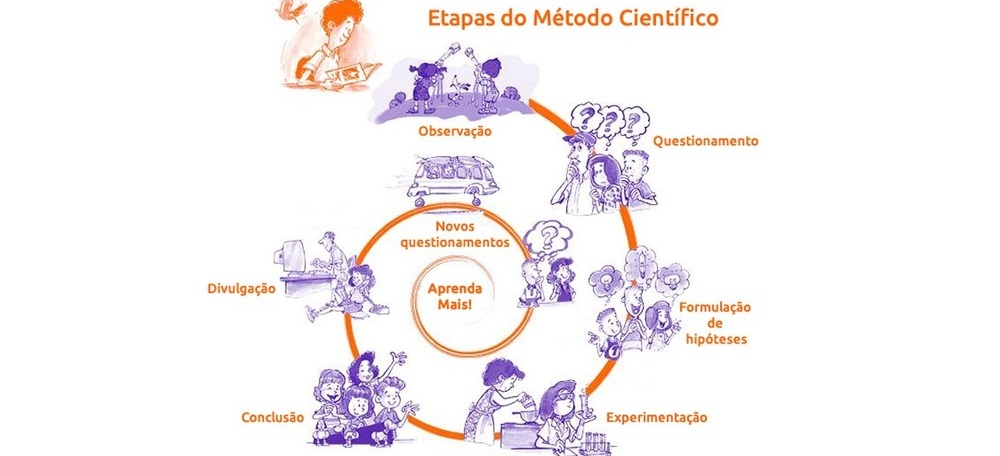

# <!-- fit --> Seminário de Iniciação à Pesquisa

### Prof. Diego Cirilo

**Aula 01**: Apresentação da disciplina

---
# Objetivos
- Refletir sobre a indissociabilidade do Ensino, da Pesquisa e da Extensão no IFRN; 
- compreender a pesquisa como princípio científico e princípio educativo; 
- conhecer a atividade de pesquisa nos Institutos Federais e no IFRN, a pesquisa aplicada e suas tecnologias sociais e a pesquisa no curso;
- difundir os projetos de pesquisa do IFRN, seja do próprio curso ou eixo tecnológico pertinente ao curso em âmbito do Brasil e do Rio Grande do Norte; 
- compreender os elementos constitutivos de um projeto de pesquisa na área técnica; e
- conhecer o fomento da pesquisa  no Brasil e no RN.

---
# Temas
- A contribuição da pesquisa para o desenvolvimento científico e tecnológico; 
- Orientação à pesquisa e às atividades acadêmicas (como fazer pesquisa; aprender por meio de pesquisas; 
- notas introdutórias sobre as formas de organização da produção do conhecimento científico; tipologia de textos e de trabalhos acadêmicos);
- Mapa da pesquisa na área da formação em curso no Brasil, no Rio Grande do Norte e no IFRN; 
- Tipos de pesquisa; e 
- Elementos constitutivos de um projeto de pesquisa científica e iniciação ao trabalho de conclusão de curso. 

---
# Cronograma (40h/a)
- 21/09 (4h/a) - Apresentação da Disciplina - Filme
- 05/10 (6h/a) - Tarefas: Filme + Estudo Dirigido Método Científico
- 19/10 (4h/a) - Método Científico e Tipos de Pesquisa e Projeto de Pesquisa
- 09/11 (6h/a) - Desenvolvimento de Projeto de Pesquisa
- 16/11 (4h/a) - Desenvolvimento de Projeto de Pesquisa - Pesquisa no IFRN
- 07/12 (6h/a) - Desenvolvimento de Projeto de Pesquisa
- 14/12 (4h/a) - Orientações Finais do Projeto
- 28/12 (6h/a) - Entrega do Projeto 

---
# <!-- fit --> O que é pesquisa?

---

---
# <!--fit--> Dúvidas? 🤔
